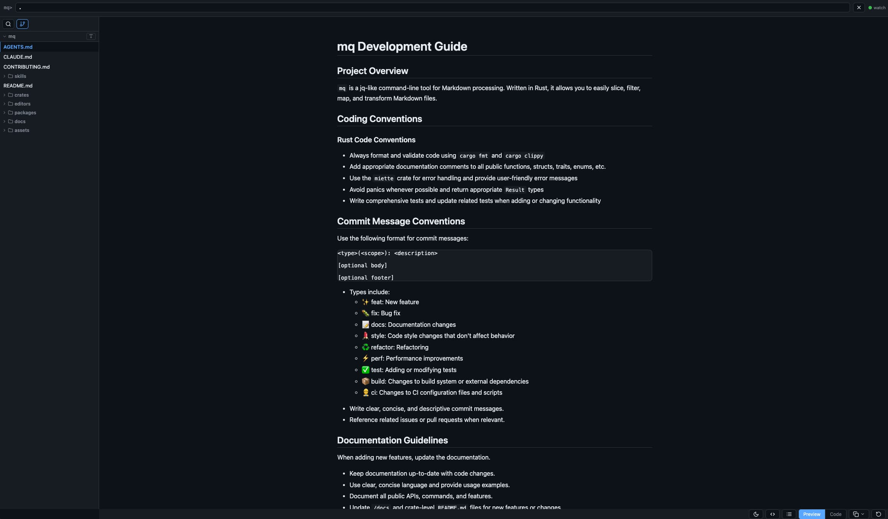

<h1 align="center">mq-serve</h1>

A browser-based Markdown viewer with [mq](https://github.com/harehare/mq) query support.
Start a local server from the CLI, open your Markdown files in the browser, and filter or transform them with mq queries in real time.



## Features

- Browser viewer: Renders Markdown in the browser with GitHub-style styling
- mq queries: Filter and transform Markdown with mq syntax (e.g. `.h`, `.code`)
- Mermaid diagrams: Renders ` ```mermaid ` code blocks as diagrams automatically
- Syntax highlighting: Code blocks highlighted
- File watch: Detects file changes and reloads the browser automatically

## Installation

### Cargo

```sh
cargo install --git https://github.com/harehare/mq-serve.git
```

## Usage

Serve files or directories:

```bash
# Current directory
mq-serve

# Specific files or directories
mq-serve docs/ README.md

# Custom port, no auto-open
mq-serve docs/ --port 8080 --no-open
```

Open `http://localhost:7700` in your browser (opened automatically by default).

## Options

```
Arguments:
  [FILES_OR_DIRS]   Markdown files or directories to serve [default: current directory]

Options:
  --port <PORT>     Port to listen on [default: 7700]
  --no-open         Do not automatically open the browser
  --no-watch        Disable file-change watching
  -h, --help        Print help
  -V, --version     Print version
```

## mq Query Examples

| Query            | Effect                                    |
| ---------------- | ----------------------------------------- |
| `.h`             | Extract all headings                      |
| `.code`          | Extract all code blocks                   |
| `.p`             | Extract all paragraphs                    |
| `.h \| upcase()` | Extract headings and convert to uppercase |

Enter a query in the bar at the top of the page and press Enter.
Click **Clear** to reset to the original content.

## Development

```bash
just build-dev
just run -- ../mq/docs
```

## License

MIT
