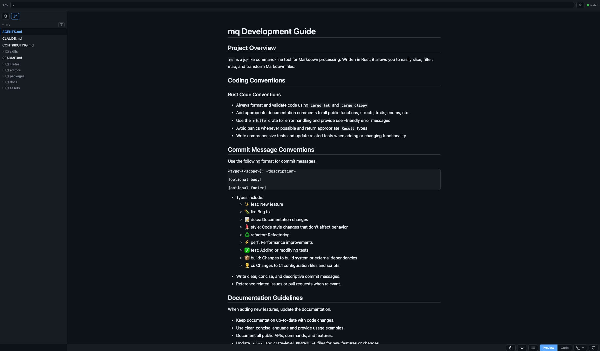

<h1 align="center">mq-serve</h1>

A browser-based Markdown viewer with [mq](https://github.com/harehare/mq) query support.
Start a local server from the CLI, open your Markdown files in the browser, and filter or transform them with mq queries in real time.



## Features

- Browser viewer: Renders Markdown in the browser with GitHub-style styling
- mq queries: Filter and transform Markdown with mq syntax (e.g. `.h`, `.code`)
- Mermaid diagrams: Renders ` ```mermaid ` code blocks as diagrams automatically
- Syntax highlighting: Code blocks highlighted
- GitHub alerts: `> [!NOTE]`, `[!TIP]`, `[!IMPORTANT]`, `[!WARNING]`, `[!CAUTION]` render as colored admonitions
- Zoom: Click an image or a rendered Mermaid diagram to view it fullscreen
- Themes: Switch instantly between Light, Dark, System, Solarized, Dracula, Nord, Monokai, Rosé Pine
- Font size: Adjust preview text size from the toolbar
- File watch: Detects file changes and reloads the browser automatically
- Persistent background server: Runs until you explicitly stop it — closing every browser tab does not shut it down
- Multi-server aware: `--status` lists every mq-serve server running on the machine, regardless of port or working directory

## Installation

### Quick Install

```bash
curl -sSL https://raw.githubusercontent.com/harehare/mq-serve/refs/heads/main/bin/install.sh | bash
```

The installer will:
- Download the latest mq binary for your platform
- Install it to `~/.local/bin/`
- Update your shell profile to add mq to your PATH

### Cargo

```sh
$ cargo install --git https://github.com/harehare/mq-serve.git
```

## Usage

`mq-serve` runs in the background by default — the command returns immediately and the shell is free straight away.

```bash
# Current directory (background, opens browser)
mq-serve

# Specific files or directories
mq-serve docs/ README.md

# Second call adds files to the already-running server
mq-serve CHANGELOG.md

# Pipe content from stdin
cat notes.md | mq-serve
some-command | mq-serve

# Custom port
mq-serve docs/ -p 8080

# Bind to all interfaces (e.g. inside Docker) — requires an explicit opt-in,
# since mq-serve has no authentication and anyone reaching the address can read your files
mq-serve docs/ --bind 0.0.0.0 --dangerously-allow-remote-access

# Run in the foreground (e.g. in a container or for debugging)
mq-serve docs/ --foreground

# Assign files to a named sidebar group
mq-serve docs/ --target "Docs"
```

Open `http://localhost:7700` in your browser (opened automatically by default).

### Single server, multiple files

If a server is already running on the given port, subsequent `mq-serve` invocations add files to the existing session instead of starting a new one.

```bash
mq-serve README.md          # starts mq-serve in the background
mq-serve CHANGELOG.md       # adds the file to the running server
```

To use a completely separate session, use a different port:

```bash
mq-serve draft.md -p 7701
```

### Persistent background servers

A background server keeps running until you explicitly stop it — closing every browser tab no longer shuts it down. Use `--status` from anywhere (any directory, any port) to see everything currently running:

```bash
mq-serve --status           # list every mq-serve server running on this machine
mq-serve --status --json    # same, as machine-readable JSON
```

```
http://127.0.0.1:7700 (v0.1.13, pid 51203)
  3 file(s)
http://127.0.0.1:7701 (v0.1.13, pid 51298)
  1 file(s)
```

Once you know a port from the list above, open, add to, or stop that specific server from anywhere:

```bash
mq-serve -p 7701            # open the browser to that server (starts it if not already running)
mq-serve report.md -p 7701  # add a file to that server
mq-serve --stop -p 7701     # stop that one server
mq-serve --stop-all         # stop every mq-serve server currently running
```

### Restarting, clearing and removing files

```bash
mq-serve --restart                    # restart the server (session is preserved)
mq-serve --clear                      # clear the saved session (restarts server if running)
mq-serve --close old-draft.md         # remove a file/directory from the running session
mq-serve --unwatch docs/              # alias for --close, for directories you no longer want watched
mq-serve --restart -p 7701            # restart/clear/close on a specific port
```

## Options

```
Arguments:
  [FILES_OR_DIRS]...  Markdown files or directories to serve. Defaults to the current directory

Options:
  -t, --target <NAME>
          Assign the given files/directories to a named group in the sidebar
  -p, --port <PORT>
          Port to listen on [default: 7700]
  -b, --bind <BIND>
          Address to bind to [default: 127.0.0.1]
      --dangerously-allow-remote-access
          Required together with a non-loopback --bind to confirm the server should be reachable from the network (it has no authentication)
      --no-open
          Do not automatically open the browser
      --open
          Always open the browser, even when adding files to an already-running server
      --no-watch
          Disable file-change watching
  -f, --foreground
          Run in the foreground instead of the background (default is background)
      --stop
          Stop the background server running on the given port
      --stop-all
          Stop every background mq-serve server currently running
      --restart
          Restart the background server running on the given port
      --status
          Show running server(s). With no other selector, lists every mq-serve server currently running on this machine, regardless of port
      --json
          Output --status as JSON instead of human-readable text
      --clear
          Clear the saved session for the given port. If a server is running it will be restarted with an empty session
      --close <PATH>...
          Remove one or more files/directories from the running session on the given port
      --unwatch <PATH>...
          Stop watching one or more files/directories on the running session on the given port. Alias for --close
  -h, --help
          Print help
  -V, --version
          Print version
```

## mq Query Examples

| Query            | Effect                                    |
| ---------------- | ----------------------------------------- |
| `.h`             | Extract all headings                      |
| `.code`          | Extract all code blocks                   |
| `.p`             | Extract all paragraphs                    |
| `.h \| upcase()` | Extract headings and convert to uppercase |

Enter a query in the bar at the top of the page and press Enter.
Click **Clear** to reset to the original content.

## Development

```bash
just build-dev
just run -- ../mq/docs
```

## License

MIT
